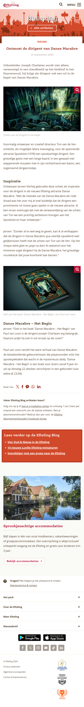
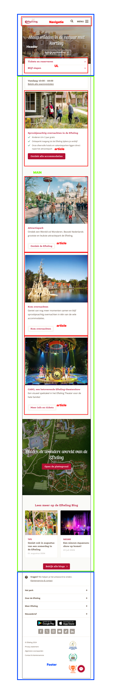
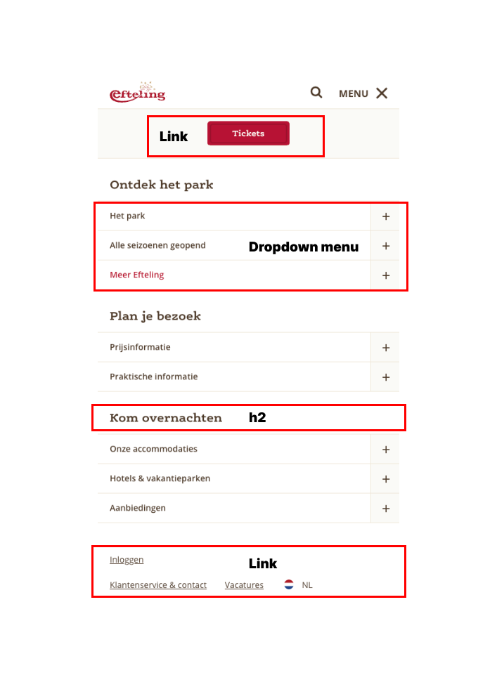
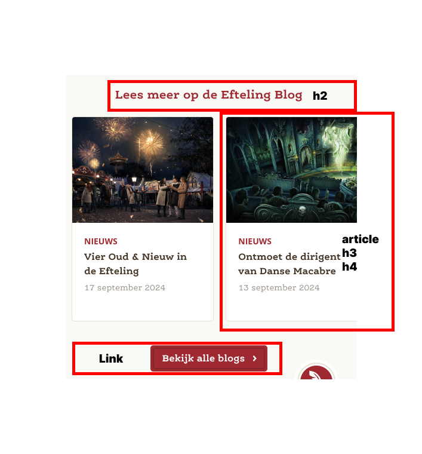
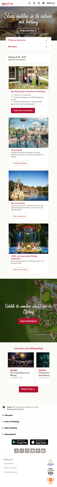
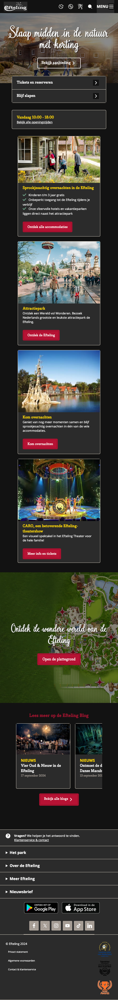

# Procesverslag
Markdown is een simpele manier om HTML te schrijven.  
Markdown cheat cheet: [Hulp bij het schrijven van Markdown](https://github.com/adam-p/markdown-here/wiki/Markdown-Cheatsheet).

Nb. De standaardstructuur en de spartaanse opmaak van de README.md zijn helemaal prima. Het gaat om de inhoud van je procesverslag. Besteedt de tijd voor pracht en praal aan je website.

Nb. Door *open* toe te voegen aan een *details* element kun je deze standaard open zetten. Fijn om dat steeds voor de relevante stuk(ken) te doen.

## Jij

  
uitwerken voor kick-off werkgroep

  ### Auteur:
  Jilke Koster

  #### Je startniveau:
  rood

  #### Je focus:
  surface plane (kies uit responsive óf surface plane)
 

## Je website

  
uitwerken voor kick-off werkgroep

  ### Je opdracht:
  Ik ga de site van de Efteling na maken.
  <a hefr="https://www.efteling.com/nl">De Efteling</a>

  #### Screenshot(s) van de eerste pagina (small screen): 
  De homepagina van de site.
  

  #### Screenshot(s) van de tweede pagina (small screen):
  De blogpagina van de site.
  
 

## Toegankelijkheidstest 1/2 (week 1)

  
uitwerken na test in 2e werkgroep

  ### Bevindingen
  Lijst met je bevindingen die in de test naar voren kwamen:
  wat mij vooral opviel is dat website van de Efteling al best wel goed toegangelijk is maar ik wel tegen 1 probleem aanloop. Dat als je op de mobile variant zit kan je niet echt goed het hamburger menu gebruiken. Op Desktop werkt die wel goed. 

## Breakdownschets (week 1)

  
uitwerken na afloop 3e werkgroep

  ### de hele pagina: 
  

  ### dynamisch deel (bijv menu): 
  

  ### wellicht nog een dynamisch deel (bijv filter): 
  

## Voortgang 1 (week 2)

  
uitwerken voor 1e voortgang

  ### Stand van zaken
  Ik vond het in het begin erg lastig om een website uit te kiezen die ik wilden gaan gebruiken voor deze opdracht. Ik had eerst Dinsey gekozen maar kwam er al snel achter dat deze niet goed er voor was, omdatt er bijna geen extra pagina's zijn. Het zijn voornaamlijk links naar andere websites.
  Na zoeken kwam ik dan uit eindelijk op de site van de Efteling. Ik ben al begonnen aan de website om de homepage te maken. Deze heb ik al voor een groot deel uitgewerkt met HTML en CSS.

  ### Agenda voor meeting
  samen met je groepje opstellen

  | student 1      | student 2          | student 3    | student 4        |
  | ---            | ---                | ---          | ---              |
  | dit bespreken  | en dit             | en ik dit    | en dan ik dat    |
  | en dat ook nog | dit als er tijd is | nog een punt | dit wil ik zeker |
  | ...            | ...                | ...          | ...              |

  ### Verslag van meeting
  Ik had nog niet echt vragen over mijn codes. 

## Voortgang 2 (week 3)

  
uitwerken voor 2e voortgang

  ### Stand van zaken
  Ik heb de HTML en CSS af van de homepage. Ik moet nog gaan nadenken welke tweede pagina ik wil gaan maken maar, ik denk dat dat waarschijnlijk een blog word. 

  ### Agenda voor meeting
  samen met je groepje opstellen

  | student 1      | student 2          | student 3    | student 4        |
  | ---            | ---                | ---          | ---              |
  | dit bespreken  | en dit             | en ik dit    | en dan ik dat    |
  | en dat ook nog | dit als er tijd is | nog een punt | dit wil ik zeker |
  | ...            | ...                | ...          | ...              |

  ### Verslag van meeting
  Ik had nog niet veel vragen over mijn codes. Alles gaat tot nu toe goed. Ik loop nog nergens echt tegen aan. 

## Toegankelijkheidstest 2/2 (week 4)

  
uitwerken na test in 9e werkgroep

  ### Bevindingen
  Lijst met je bevindingen die in de test naar voren kwamen (geef ook aan wat er verbeterd is):
  Als ik heel eerlijk ben dan is de orginele site van de Efteling beter als het om toegangelijke gaat dan die van mij. Ik vond het soms best lastig om er steeds rekening mee te houden dat voor iedereen gebruikbaar is. 

## Voortgang 3 (week 4)

  
uitwerken voor 3e voortgang

  ### Stand van zaken
  Mijn site is eigenlijk bijna al helemaal af. Ik moet bij een paar punten nog wat meer focus leggen zoals op somige vormgeving van de site. 

  ### Agenda voor meeting
  samen met je groepje opstellen

  | student 1      | student 2          | student 3    | student 4        |
  | ---            | ---                | ---          | ---              |
  | dit bespreken  | en dit             | en ik dit    | en dan ik dat    |
  | en dat ook nog | dit als er tijd is | nog een punt | dit wil ik zeker |
  | ...            | ...                | ...          | ...              |

  ### Verslag van meeting
  - Soms laad mijn Javascript niet goed in. Dat doet het nog steeds niet. Heb er met meerdere naar gekeken.
  - Voor de rest zij  al mijn vragen beantwoord en kan ik de laatste dingen af ronden voor dit vak. 

## Eindgesprek (week 5)

  
uitwerken voor eindgesprek

  ### Je uitkomst - karakteristiek screenshots:
  

  ### Dit ging goed/Heb ik geleerd: 
  Ik heb verschillende dingen geleerd vooral als het gaat om Javascript maar ben vooral het meest trost op de dark-mode.

  

  ### Dit was lastig/Is niet gelukt:
  Wat ik lastig vind is dat mijn Javascript nog steeds niet af en toe niet goed inlaad. Maar als ik 'command + shift + R' doe dan doet hij het wel.
  Wat ik ook nog steeds wel lastig vind is het niet zo veel classes en div's mogen gebruiken. Dat zit er bij mij heel erg ingeslepen.

## Bronnenlijst

  
continu bijhouden terwijl je werkt

  Nb. Wees specifiek ('css-tricks' als bron is bijv. niet specifiek genoeg). 
  Nb. ChatGpT en andere AI horen er ook bij.
  Nb. Vermeld de bronnen ook in je code.

  1. https://www.svgrepo.com/collection/nilicons-rounded-interface-icons/
  2. https://jakearchibald.github.io/svgomg/
  3. https://www.jsdelivr.com/?query=firewor
  4. https://phosphoricons.com/?q=%22%22
  5. https://youtu.be/wodWDIdV9BY?si=YeAQkwO5TRM3A5ap
  6. https://developer.mozilla.org/en-US/docs/Web/API/Element/classList
  7. https://developer.mozilla.org/en-US/docs/Web/API/Window/localStorage
  8. https://youtu.be/hq_tKbSzAiY?si=pIt_AIdtApSarWIW 
  9. https://youtu.be/huVJW23JHKQ?si=S5cjHfQjpvrDcYnQ
  10. https://youtu.be/C9EWifQ5xqA?si=GWrwuQ9QHoD4XL1J
  11. https://developer.mozilla.org/en-US/docs/Web/API/Event/preventDefault

